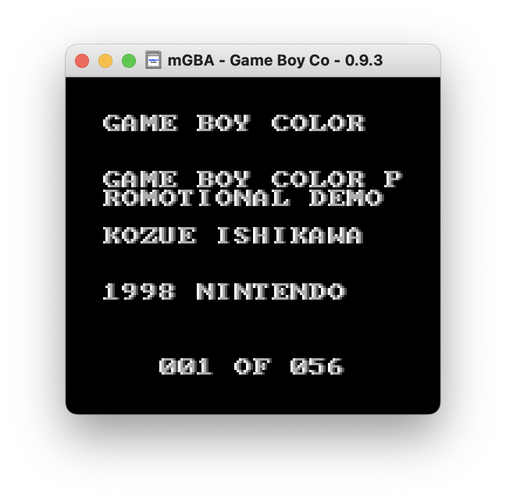

# GBS2GB-Go
A reimplementation of GBS2GB in Go

## What is "GBS2GB"?

GBS2GB was originally [a Visual Basic 5.0 tool by ugetab](https://www.angelfire.com/nc/ugetab/), later adapted into [a Python 2 script by Kuwanger](https://web.archive.org/web/20191013103309/http://www.kuwanger.altervista.org/gbs2gb.txt), to pack Game Boy Sound (.GBS) files into .GB files that can be run by emulators.



## Why rewrite it?

Visual Basic 5.0 is dead and Python 2 is **hilariously** obsolete. A rewrite in Go makes this tool cross-platform without requiring any dependencies.

## Usage

```sh
$ gbs2gb -h
Usage:
  gbs2gb [OPTIONS]

Application Options:
  -i, --input=   Input GBS file
  -o, --outdir=  Output directory (default: ./)
  -v, --version  Show version and exit

Help Options:
  -h, --help     Show this help message
```

Running `gbs2gb -i ./Alleyway.gbs -o out` will produce a ROM at `./out/Alleyway.gb`. That's all there is to it.